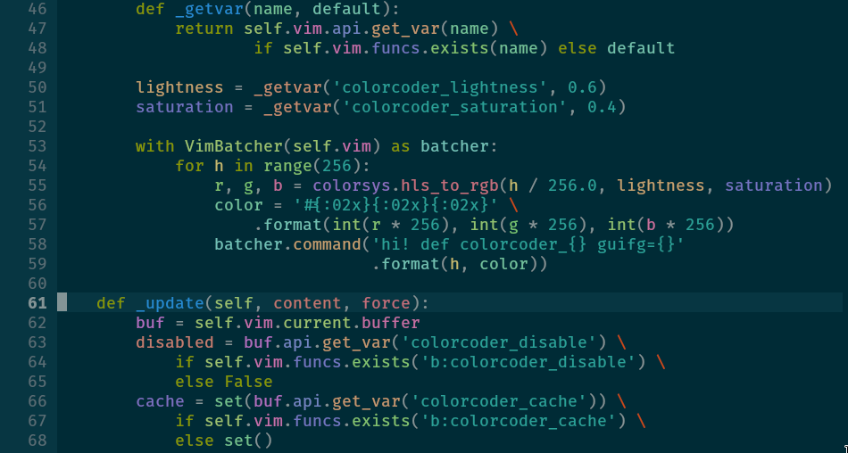

NeoVim-ColorCoder
=================

Coding in color. See [this post](https://medium.com/@evnbr/coding-in-color-3a6db2743a1e) for more details.

Some key features:

* Works with all filetypes
* Auto generated colors (configurable)
* Fast and asynchronous
* Ignore keywords based on syntax file

**This plugin runs on NeoVim only, requires Python and TrueColor support**

Installation
------------

For vim-plug:

    Plug 'blahgeek/neovim-colorcoder', { 'do' : ':UpdateRemotePlugins' }

Any other plugin manager should be fine, just remember to call `:UpdateRemotePlugins`
after installing and updating.

Usage
-----

Add following line to your `init.vim` to start using:

    let g:colorcoder_enable_filetypes = ['c', 'cpp', 'python']

See [documentation](./doc/colorcoder.txt) for details.

